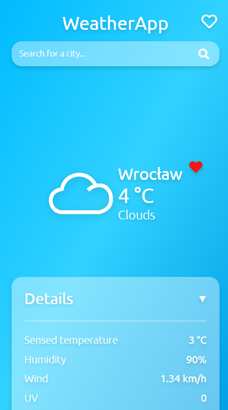
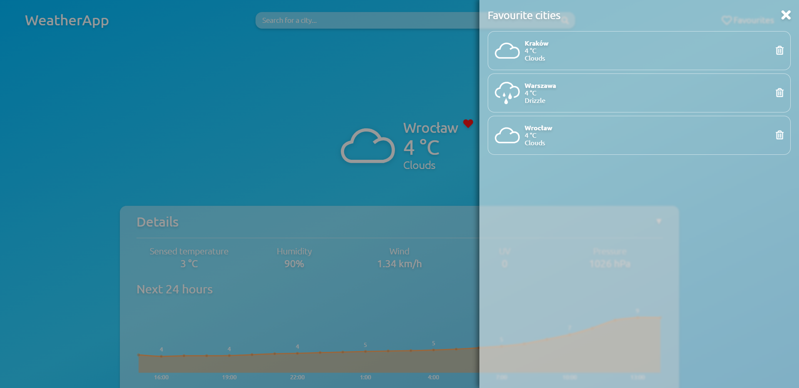

# WeatherApp

WeatherApp is my approach to a very popular "weather app" type of project. It was written with primary focus on:
* TypeScript,
* MVC pattern, 
* mobile-first design. 

It uses OpenWeatherMap API.

## Features
* Displaying current weather data
* Graph with a weather forecast for the next 24 hours
* Displaying weather forecast for a next week
* List of favourite cities
* Using geolocation to get user's current city
* Remembering last seen city
* Fully responsive web app

## Screenshots




## Setup
First you need to install packages using:
```
npm install
```

You also have to create .env file in the root directory with your own OpenWeatherMap API key, like: 
```
API_KEY=your_key
```

The app is configured with Webpack in a way that just lets you open it with hot reload using:
```
npm start
```

## Technologies
* TypeScript
* SCSS
* Webpack
* Babel
* ESLint
* Prettier
* Chart.JS
* OpenWeatherMap API